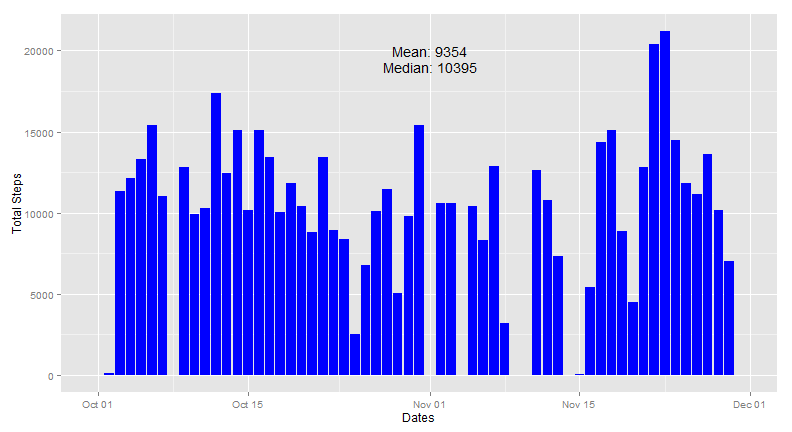
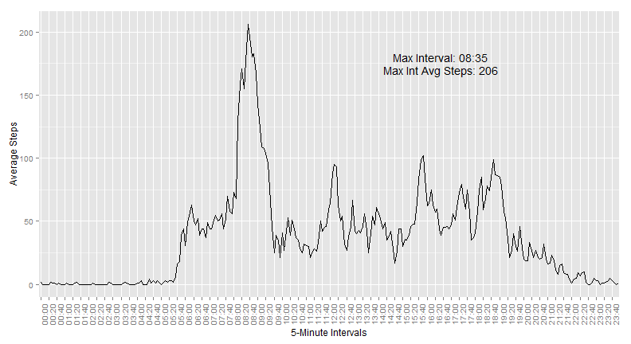
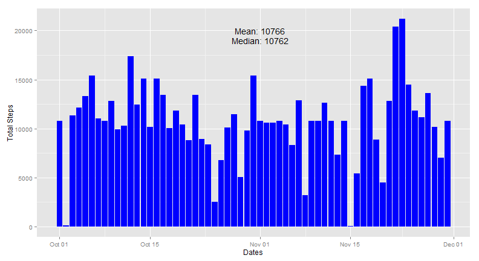
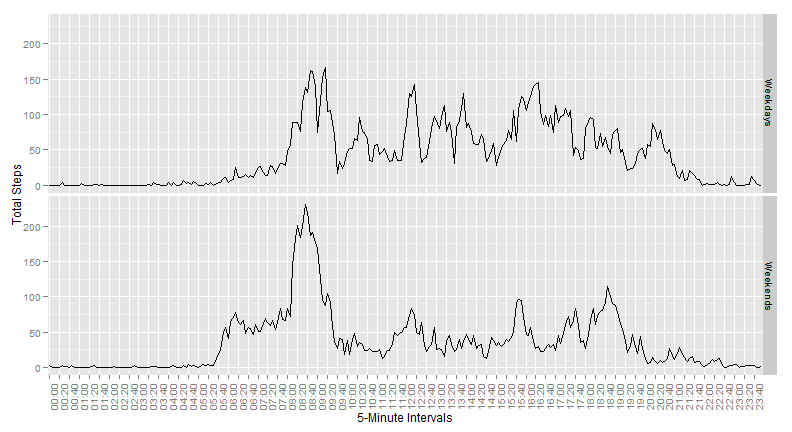

## Reproducible Research Peer Assessment 1
========================================================

- *Author: Steve Petersen*
- *Date: May 17, 2014*

### Introduction

This project is an analysis of personal movement using activity monitoring devices.This project makes use of data from a personal activity monitoring device. This device collects data at 5 minute intervals through out the day. The data consists of two months of data from an anonymous individual collected during the months of October and November, 2012 and include the number of steps taken in 5 minute intervals each day.

### Activities

The following steps will be performed on the data:

- Loading and preprocessing the data
- Make a histogram of the total number of steps taken each day
- Calculate and report the mean and median total number of steps taken per day
- Make a time series plot of the 5-minute interval and the average number of steps taken, averaged across all days.
- Determine which 5-minute interval, on average across all the days in the dataset, contains the maximum number of steps.
- Calculate and report the total number of missing values in the dataset.
- Implement a strategy for inputing missing values.
- Make a histogram of the total number of steps taken each day and calculate and report the mean and median total number of steps taken per day. 
- Evaluate if these values differ from the estimates from the first part of the assignment.
- Evaluate the impact of imputing missing data on the estimates of the total daily number of steps.
- Create a new factor variable in the dataset with two levels - "weekday" and "weekend" indicating whether a given date is a weekday or weekend day.
- Make a panel plot containing a time series plot of the 5-minute interval and the average number of steps taken, averaged across all weekday days or weekend days.

### Data

The data was aquired from here:

https://d396qusza40orc.cloudfront.net/repdata%2Fdata%2Factivity.zip

The variables included in this dataset are:

- **steps**: Number of steps taking in a 5-minute interval (missing values are coded as NA)

- **date**: The date on which the measurement was taken in YYYY-MM-DD format

- **interval**: Identifier for the 5-minute interval in which measurement was taken


### R Code & Plots

First we load the necessary libraries.


```r
library(plyr)
library(ggplot2)
```

Next the data is loaded and the 24-hour times converted into a formatted representation.


```r
dr <- read.csv("./repdata_data_activity/activity.csv", colClasses = c("numeric", 
    "Date", "numeric"))
dr$interval <- as.character(paste(substring(sprintf("%04d", dr$interval), 1, 
    2), ":", substring(sprintf("%04d", dr$interval), 3, 4), sep = ""))
```

Now a summary data frame is created giving total steps for each day. NAs are not included.


```r
d <- ddply(dr, .(date), summarize, sum = sum(steps, na.rm = TRUE))
```

Now the first plot, a histogram showing total steps per day using ggplot.


```r
ggplot(d, aes(date, y = sum)) + geom_histogram(fill = "blue", stat = "identity") + 
    annotate("text", x = as.Date("2012-11-01"), y = 20000, label = paste(c("Mean:"), 
        round(mean(d$sum), 0))) + annotate("text", x = as.Date("2012-11-01"), 
    y = 19000, label = paste(c("Median:"), round(median(d$sum), 0))) + xlab("Dates") + 
    ylab("Total Steps")
```

 

Now a summary data frame is created giving average steps for each 5-minute interval.


```r
d <- ddply(dr, .(interval), summarize, avg = round(mean(steps, na.rm = TRUE), 
    0))
```

And now a line plot of the averages per 5-minute interval.


```r
ggplot(d, aes(x = interval, y = avg, group = 1)) + geom_line(fill = "blue", 
    stat = "identity") + annotate("text", x = 200, y = 180, label = paste(c("Max Interval:"), 
    d[d$avg == max(d$avg), 1])) + annotate("text", x = 200, y = 170, label = paste(c("Max Int Avg Steps:"), 
    d[d$avg == max(d$avg), 2])) + theme(axis.text.x = element_text(angle = 90)) + 
    scale_x_discrete(breaks = d$interval[seq(1, 288, by = 4)]) + xlab("5-Minute Intervals") + 
    ylab("Average Steps")
```

 

A summary count of the NAs versus non-NAs in the original data frame.


```r
count(is.na(dr$steps))
```

```
##       x  freq
## 1 FALSE 15264
## 2  TRUE  2304
```

Here the step attributes with NAs in the original data frame are replaced with the average of the corresponding 5-minute interval, using the previously plotted data frame above.


```r
drnas <- which(is.na(dr$steps))
for (i in 1:length(drnas)) {
    dr$steps[drnas[i]] <- d$avg[dr$interval[drnas[i]] == d$interval]
}
```

And now a summary data frame of total steps by day is built.


```r
d <- ddply(dr, .(date), summarize, sum = round(sum(steps, na.rm = TRUE), 2))
```

And a the same plot as the first plot is created now with NAs transformed into corresponding 5-minute interval averages.


```r
ggplot(d, aes(date, y = sum)) + geom_histogram(fill = "blue", stat = "identity") + 
    annotate("text", x = as.Date("2012-11-01"), y = 20000, label = paste(c("Mean:"), 
        round(mean(d$sum), 0))) + annotate("text", x = as.Date("2012-11-01"), 
    y = 19000, label = paste(c("Median:"), round(median(d$sum), 0))) + xlab("Dates") + 
    ylab("Total Steps")
```

 

The original data frame has a column appended with a factor indicating if the measurement is a weekday or a weekend.


```r
dr$day_type <- as.factor(ifelse(weekdays(dr$date) != "Sunday" & weekdays(dr$date) != 
    "Saturday", "Weekends", "Weekdays"))
```

A summary data frame with average steps per weekend or weekday and 5-minute interval is created.


```r
d <- ddply(dr, .(day_type, interval), summarize, avg = round(mean(steps, na.rm = TRUE), 
    0))
```

And here we plot two facets in one column with weekday averages per 5-minute intervals on top and weekend averages per 5-minute intervals on the bottom.


```r
ggplot(d, aes(x = interval, y = avg, group = day_type)) + geom_line(fill = "blue", 
    stat = "identity") + theme(axis.text.x = element_text(angle = 90)) + scale_x_discrete(breaks = d$interval[seq(1, 
    288, by = 4)]) + facet_grid(day_type ~ .) + xlab("5-Minute Intervals") + 
    ylab("Total Steps")
```

 

